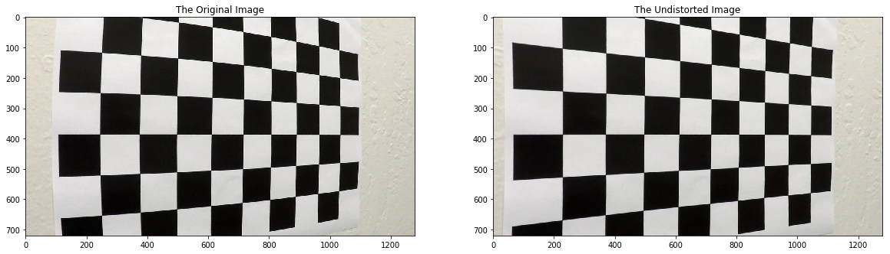
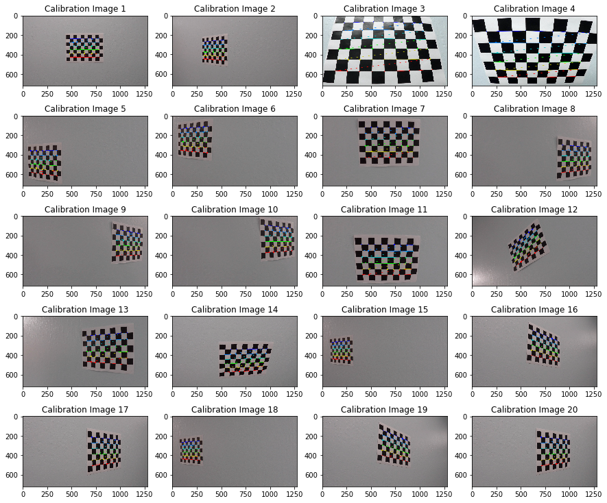
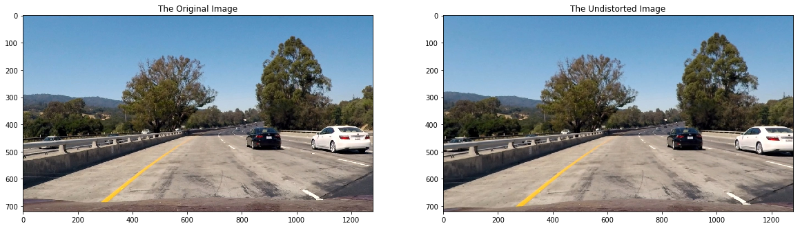
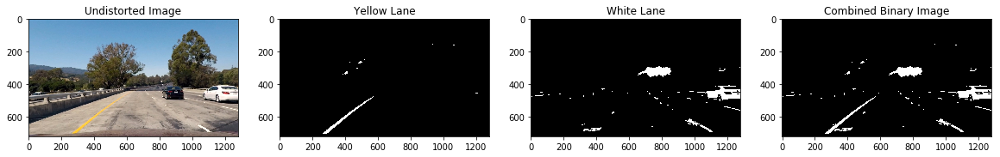
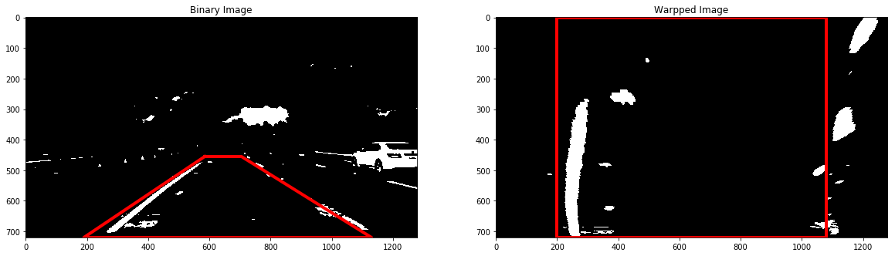
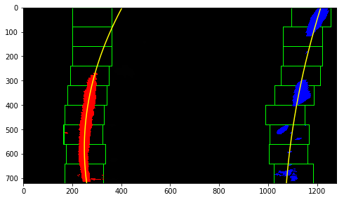
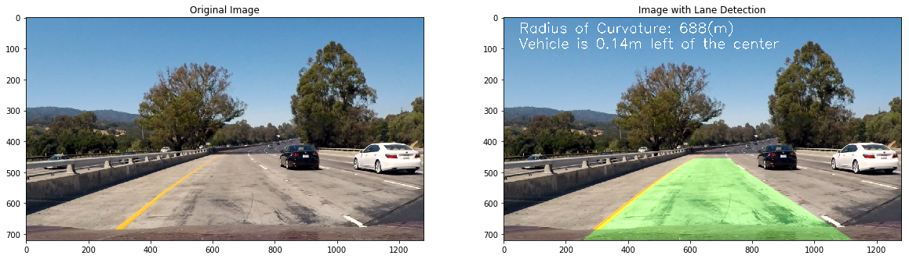

# Self-Driving Car Project 4. Advanced Lane Finding

## Project Overview

My goal of this project is to write a software pipeline to identify the lane boundaries in a video. The steps are:

* Compute the camera calibration matrix and distortion coefficients given a set of chessboard images
* Apply a distortion correction to raw images
* Use color transforms, gradients, etc., to create a thresholded binary image
* Apply a perspective transform to rectify binary image ("birds-eye view")
* Detect lane pixels and fit to find the lane boundary
* Determine the curvature of the lane and vehicle position with respect to center
* Warp the detected lane boundaries back onto the original image
* Output visual display of the lane boundaries and numerical estimation of lane curvature and vehicle position

The images for camera calibration are stored in the folder called `camera_cal`. The images in `test_images` are for the pipeline on single frames. To extract more test images from the videos, let's simply use an image writing method like `cv2.imwrite()`, i.e., we can read the video in frame by frame as usual, and for frames we want to save for later we can write to an image file.  

The examples of the output from each stage of the pipeline are saved in the folder called `output_images`. The video called `project_video.mp4` is the video which the pipeline will work well on.  

## Camera Calibration

### Compute the Camera Matrix and Distortion Coefficients

The code for this step is contained in the first code cell of the IPython notebook located in "[./carnd-advanced-lane-finding-project.ipynb](./carnd-advanced-lane-finding-project.ipynb)" or "[./carnd-advanced-lane-finding-project.html](./carnd-advanced-lane-finding-project.html)".

I start by preparing "object points" (using the class `CameraCalibrater`,) which will be the (x, y, z) coordinates of the chessboard corners in the world. Here I am assuming the chessboard is fixed on the (x, y) plane at z=0, such that the object points are the same for each calibration image.  Thus, `CameraCalibrater.objp` is just a replicated array of coordinates, and `CameraCalibrater.object_points` will be appended with a copy of it every time I successfully detect all chessboard corners in a test image.  `CameraCalibrater.image_points` will be appended with the (x, y) pixel position of each of the corners in the image plane with each successful chessboard detection.

I then used the output `CameraCalibrater.object_points` and `CameraCalibrater.image_points` to compute the camera calibration and distortion coefficients using the `cv2.calibrateCamera()` function.  I applied this distortion correction to the test image using the `cv2.undistort()` function and obtained this result:

## Image Pipeline

### 1. Create Distortion-Corrected Image

To demonstrate this step, I will describe how I apply the distortion correction to one of the test images like this one (with the original image on the left and the distortion-corrected image on the right):

### 2. Create Thresholded Binary Image

I used a combination of color and gradient thresholds to generate a binary image (thresholding steps at code section 5 in "[./carnd-advanced-lane-finding-project.ipynb](./carnd-advanced-lane-finding-project.ipynb)" or "[./carnd-advanced-lane-finding-project.html](./carnd-advanced-lane-finding-project.html)").  Here's an example of my output for this step:

### 3. Transform Image

The code for my perspective transform includes a helper class called `ImageWarper`, which appears in code section 7 in the file "[./carnd-advanced-lane-finding-project.ipynb](./carnd-advanced-lane-finding-project.ipynb)" or "[./carnd-advanced-lane-finding-project.html](./carnd-advanced-lane-finding-project.html)".  The `ImageWarper.get_warped_image()` function takes an image (`image`) as the input, and use the source points (`ImageWarper.source_matrix`) and destination points (`ImageWarper.destination_matrix`).  I chose the hardcode the source points and destination points as following:

|   Source    | Destination        |
| :---------: | :----------------- |
|  585, 455   | 200, 0             |
|  705, 455   | max_x - 200, 0     |
| 1130, max_y | max_x - 200, max_y |
| 190, max_y  | 200, max_y         |

Note the `ImageWarper.image_shape` is initialized as following:

`ImageWarper.image_shape = (input_image_shape[1], input_image_shape[0])`

So, the `max_x` is ``ImageWarper.image_shape[0]`, the `max_y` is `ImageWarper.image_shape[1]`.

I verified that my perspective transform was working as expected by drawing the source points (`ImageWarper.source_matrix`) and destination points (`ImageWarper.destination_matrix`) onto a test image and its warped counterpart to verify that the lines appear parallel in the warped image.

### 4. Identified Lane Lines

The line detection code is a class `LaneDetector` at code section 9 in the file "[./carnd-advanced-lane-finding-project.ipynb](./carnd-advanced-lane-finding-project.ipynb)" or "[./carnd-advanced-lane-finding-project.html](./carnd-advanced-lane-finding-project.html)". The `LaneDetector` calculates the histogram on the X axis, finds the picks on the right and left side of the image, and collects the non-zero points contained on those windows. When all the points are collected, it uses `np.polyfit` to perform a polynomial fit to find the line model. It performs another polynomial fit on the same points transforming pixels to meters that helps the curvature calculation later. The following picture shows the points found on each window, the windows and the polynomials:

### 5. Calculate the Curvature and Position

This code for calculating the radius of curvature of the lane and the position of the vehicle with respect to center is at section 11 in "[./carnd-advanced-lane-finding-project.ipynb](./carnd-advanced-lane-finding-project.ipynb)" or "[./carnd-advanced-lane-finding-project.html](./carnd-advanced-lane-finding-project.html)".

The polynomial produced by Step 4 is used here to calculate the curvature. Here are the steps to find the vehicle position on the center:

- Get the lane center by evaluating the left and right polynomials at the maximum Y and find the middle point
- Get the vehicle center transforming the center of the image from pixels to meters
- The sign of the distance between the lane center and the vehicle center tells whether the vehicle is on to the left or the right

### 6. Plot Back Down onto Road with Lane

I implemented this step in code sections 11 - 12 in "[./carnd-advanced-lane-finding-project.ipynb](./carnd-advanced-lane-finding-project.ipynb)" or "[./carnd-advanced-lane-finding-project.html](./carnd-advanced-lane-finding-project.html)" in the class `LaneTextRenderer`.  Here is an example of my result on a test image:

## Video Pipeline

### The Final Video Output
The  pipeline performed reasonably well on the entire project video. The code is section 13 - 16 in "[./carnd-advanced-lane-finding-project.ipynb](./carnd-advanced-lane-finding-project.ipynb)" or "[./carnd-advanced-lane-finding-project.html](./carnd-advanced-lane-finding-project.html)". There are a few wobbly lines but no catastrophic failures that would cause the car to drive off the road.

The video result file is "[./project_video_output.mp4](./project_video_output.mp4)."

## Discussion

### Brief Discussion on the Implementation
- There is still problems detecting the lane where there are light noises in the challenge videos, we can try some other color spaces to reduce the light noises
- The speed to produce the video is a little bit slow, there is space to improve the algorithm of the line detection and calculations
- More improvements and information could be use from frame to frame to make pipeline more robust

## Appendix

#### Reviews from Udacity:
It is obvious that you have put a lot of thought and hard work into this project, and the results are very impressive! The pipeline does an excellent job of identifying the lane lines in the project video, and the write-up is very thorough, making your project a pleasure to review!

I am super happy that you visited and got useful information from the Slack Channel and are having a great learning experience. Keep up with this spirit and post your difficulties on the channel as well, sure you will make a great Self-Driving Car Engineer.

This work could be nominated for excellence, as such, it will be nice to get feedback of the experience in the comment section after rating this review. Good luck with the next project!
